# Receitas — trabalho de Desenvolvimento Android

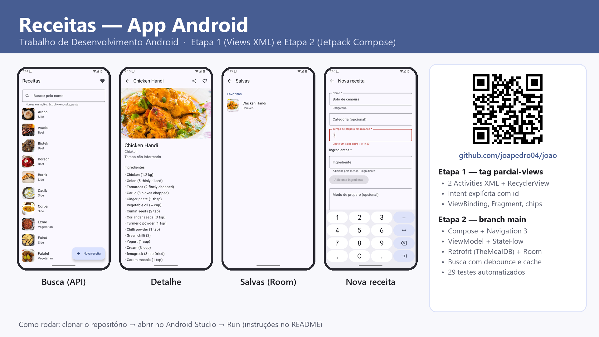

## Objetivo

App para **encontrar receitas, ver os detalhes, favoritar e cadastrar as suas próprias receitas**.
As receitas vêm da API pública [TheMealDB](https://www.themealdb.com/api.php). Tudo o que o usuário
favorita ou cria fica salvo no celular (Room) e continua lá depois de fechar e abrir o app.

**Fluxo completo:** buscar receitas na API → ver a lista → abrir o detalhe → favoritar ou criar uma
receita → fechar e reabrir o app → as receitas continuam na tela **Salvas**.

> **Etapas no Git**
> - Parcial (Android Views + XML): tag [`parcial-views`](../../tree/parcial-views)
> - Etapa 2 (Jetpack Compose): tag [`etapa2-compose`](../../tree/etapa2-compose) e branch `main`

## Telas (prints do app rodando no emulador)

| Busca (API) | Detalhe | Salvas (Room) | Validação |
|---|---|---|---|
| 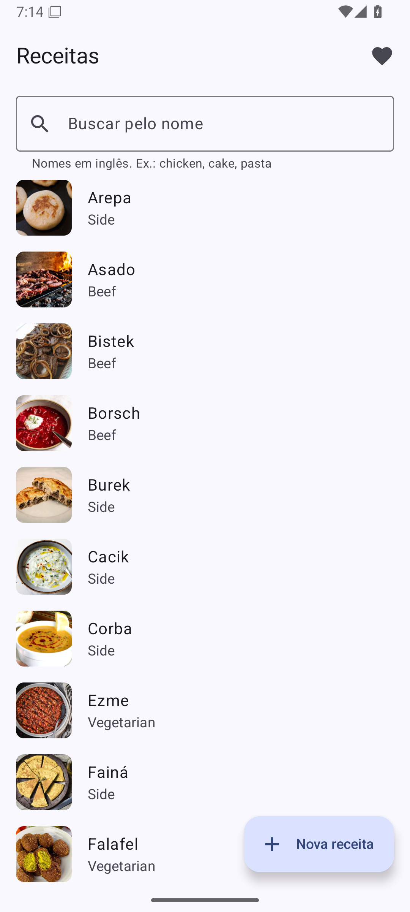 | 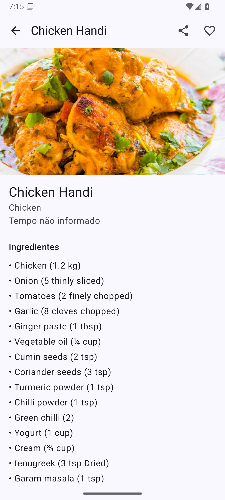 | 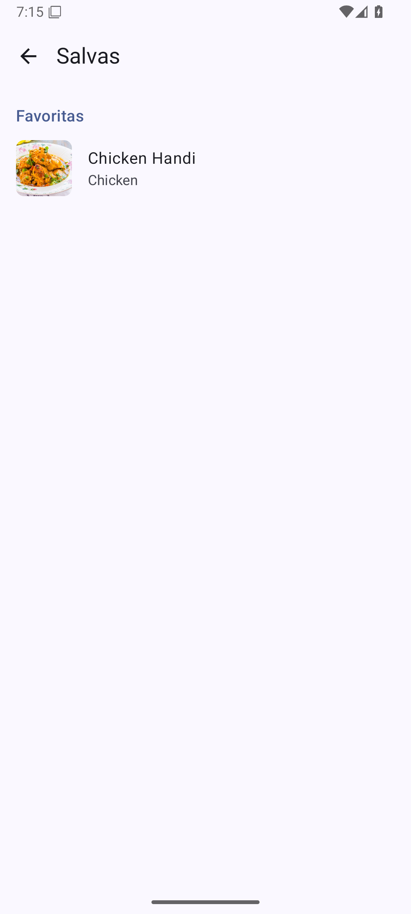 | 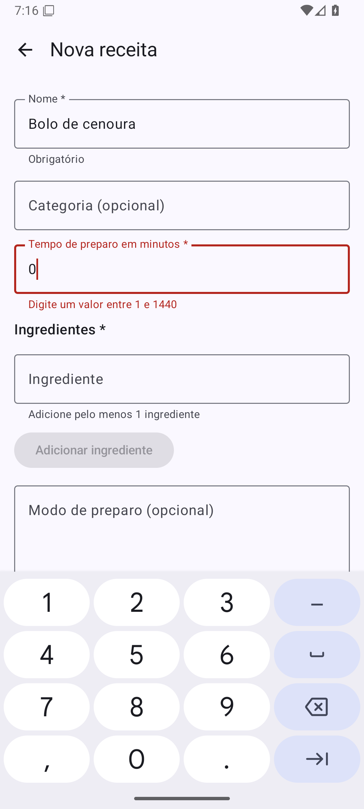 |

| Snackbar de sucesso | Após fechar e reabrir | Erro sem internet | Fonte do sistema no máximo |
|---|---|---|---|
| 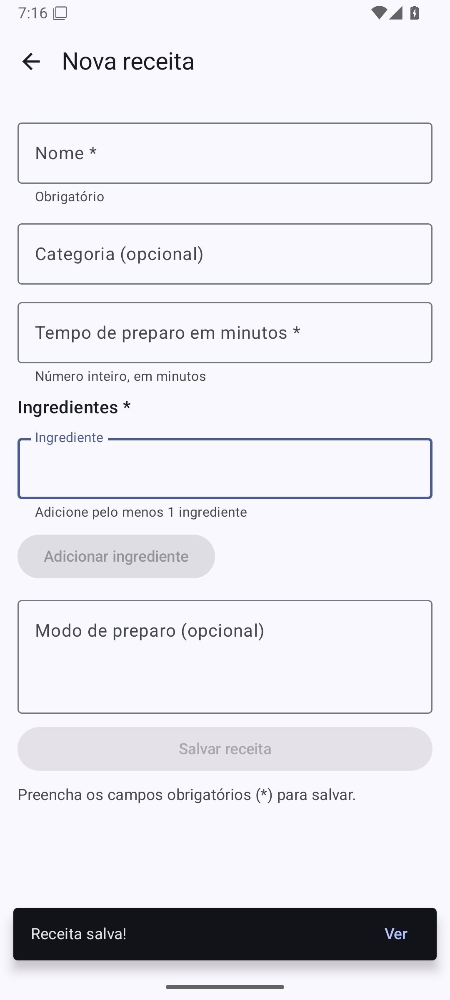 | 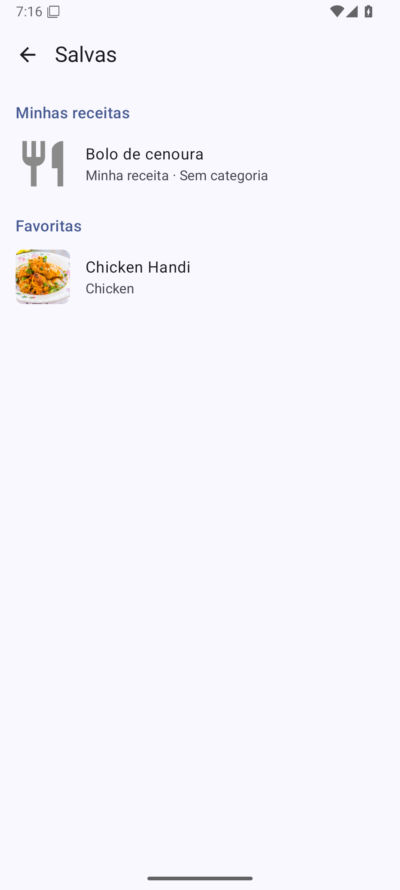 | 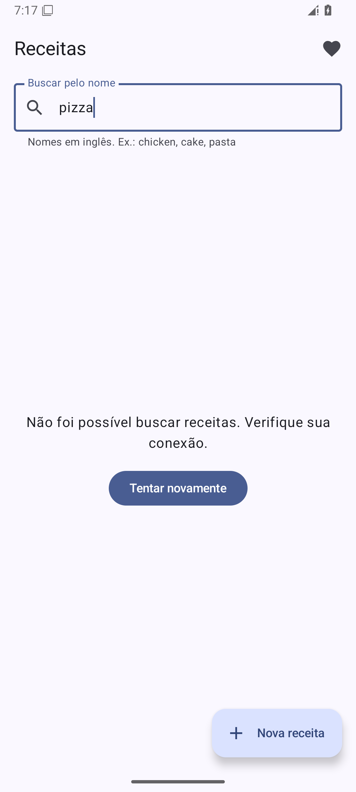 | 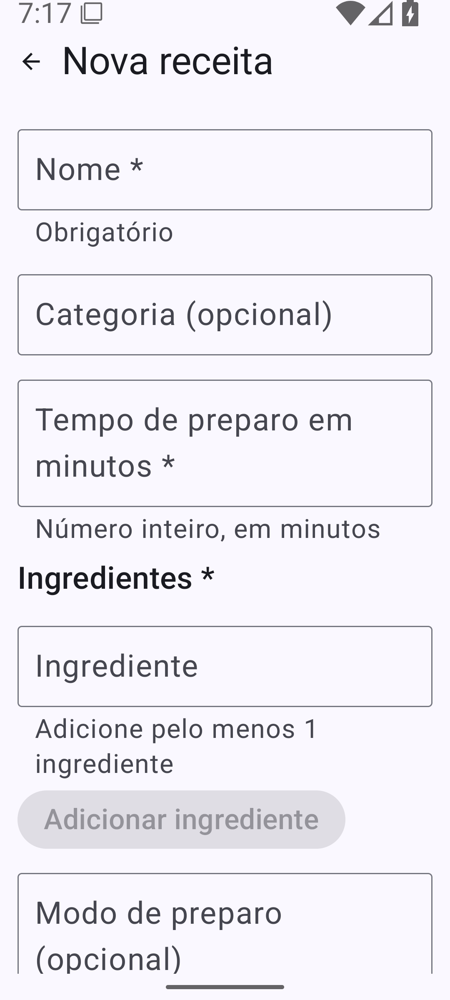 |

Parcial (Views XML):

| Lista (RecyclerView) | Detalhe (favoritar + chips) |
|---|---|
| 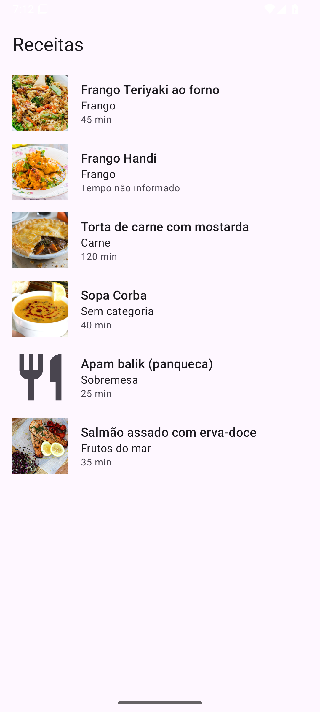 | 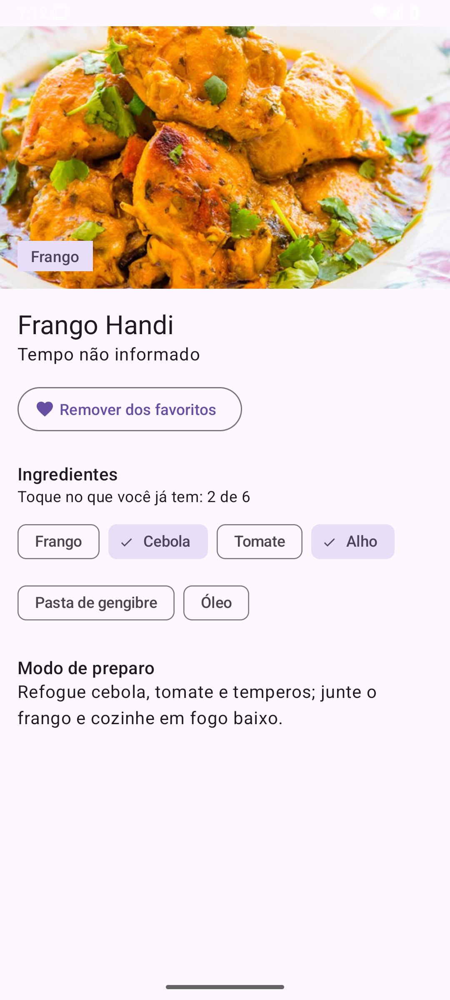 |

## Como rodar

| Item | Versão |
|---|---|
| Android Studio | Rabbit 1 (2026.2.1) ou mais recente |
| JDK | 17 ou mais recente (o JBR que vem com o Android Studio já serve) |
| minSdk / targetSdk / compileSdk | 24 (Android 7.0) / 37 / 37 |
| Gradle / AGP / Kotlin | 9.8.0 (wrapper) / 9.4.1 / 2.4.20 |

1. Clone o repositório: `git clone <url-deste-repositório>`
2. No Android Studio: **File > Open** e escolha a pasta do projeto.
3. Aguarde o *Gradle Sync*. O Android Studio baixa sozinho o SDK que faltar e cria o `local.properties`.
4. Escolha um emulador ou celular com Android 7.0 ou mais recente e clique em **Run**.
5. O celular/emulador precisa de **internet** para a primeira busca. Depois disso, as receitas já vistas abrem offline.

Pela linha de comando:

```bash
./gradlew assembleDebug            # gera o APK
./gradlew testDebugUnitTest        # testes unitários (não precisa de emulador)
./gradlew connectedDebugAndroidTest  # testes de UI (precisa de emulador/celular conectado)
```

**Chaves e senhas:** o projeto não usa nenhuma. A URL do TheMealDB contém `1`, que é a chave
**pública de teste** documentada pelo próprio site. Ela não é um segredo, por isso não há `.env`.

**Dica:** a API tem nomes em inglês. Experimente buscar `chicken`, `cake` ou `pasta`.

## Bibliotecas externas

| Biblioteca | Para que serve |
|---|---|
| Jetpack Compose (BOM) + Material 3 | Toolkit de UI declarativa e componentes Material 3 (TopAppBar, TextField, Snackbar…). |
| Activity Compose | Liga o Compose à Activity (`setContent`). |
| Navigation 3 | Navegação entre telas com uma pilha de rotas controlada pelo app (`NavDisplay`). |
| Lifecycle ViewModel / Runtime Compose | `ViewModel`, `viewModelScope` e `collectAsStateWithLifecycle`. |
| Lifecycle ViewModel Navigation 3 | Dá a cada tela da pilha seus próprios ViewModels. |
| Room (+ KSP) | Banco SQLite com consultas verificadas na compilação e retorno em `Flow`. KSP gera o código do Room. |
| Retrofit + converter kotlinx.serialization | Cliente HTTP que transforma os endpoints da API em funções `suspend`. |
| kotlinx.serialization | Converte JSON em classes Kotlin e permite salvar as rotas da navegação. |
| Coil 3 (compose + okhttp) | Baixa e mostra as fotos das receitas, com cache. |
| JUnit 4, kotlinx-coroutines-test | Testes unitários e controle do tempo virtual nas coroutines (debounce). |
| Compose UI Test, AndroidX Test | Testes de interface no emulador. |

## Requisitos → onde estão implementados

### Etapa 2 (Compose)

| Requisito | Onde |
|---|---|
| Telas coerentes com o tema | `ui/busca`, `ui/detalhe`, `ui/salvas`, `ui/novareceita` |
| Navigation 3: rotas, entries, back stack, argumentos | `ui/navigation/Rotas.kt` (`@Serializable` + `NavKey`, `DetalheRota(receitaId)`), `ui/navigation/AppNavegacao.kt` (`rememberNavBackStack`, `NavDisplay`, `entryProvider`, decorators) |
| LazyColumn com `key` | `BuscaScreen.ListaReceitas`, `SalvasScreen` |
| Formulário com validação e feedback | `ui/novareceita/NovaReceitaScreen.kt` (`isError`, `supportingText`, botão desabilitado, Snackbar); regras em `domain/validacao/ValidadorReceita.kt` |
| ViewModel + StateFlow + `collectAsStateWithLifecycle` + fluxo unidirecional | Todos os `*ViewModel.kt` e `*Screen.kt` (a tela chama funções do VM e só recebe estado) |
| Estados Carregando / Sucesso / Vazio / Erro | `BuscaUiState` (sealed interface) e componentes em `ui/components/Estados.kt` |
| Estado preservado após rotação | Dados no ViewModel; termo da busca no `SavedStateHandle` (`BuscaViewModel`); pilha salva por `rememberNavBackStack` |
| Repository | `data/repository/ReceitaRepository.kt` (interface) e `ReceitaRepositoryImpl.kt` (API + Room) |
| Coroutines, escopo e cancelamento | `viewModelScope`; `Dispatchers.IO` no repository; `debounce` + `flatMapLatest` em `BuscaViewModel` |
| Persistência local reativa | Room: `data/local/` (tabelas `receitas`, `favoritos`, `buscas_cache`; DAO com `Flow`) |
| Sem segredos no Git | Não há chaves; `local.properties` no `.gitignore` |
| Acessibilidade | `contentDescription` em ícones e fotos (`null` nos decorativos), cores do `MaterialTheme`, `IconButton`/`ListItem` com 48dp, textos em `sp` via tipografia, telas com rolagem, títulos marcados com `heading()` |

### Opcionais da Etapa 2

| Opcional | Onde |
|---|---|
| DTO → domínio → UI | `data/remote/MealDto.kt` → `data/repository/ReceitaMappers.kt` → `domain/model/Receita.kt` → `ui/components/ReceitaItem.kt` (`ReceitaItemUi`) |
| Injeção manual de dependências | `di/AppContainer.kt`, criado em `ReceitasApp` |
| Testes | `app/src/test` (validador, ViewModels com repository fake, cache do repository) e `app/src/androidTest` (UI do formulário e da busca) |
| Cache com expiração + offline-first | `ReceitaRepositoryImpl.buscar`: o termo buscado há menos de 1 hora sai do banco; sem rede, usa o que estiver salvo |
| Animações implícitas | `AnimatedContent` entre estados, `animateItem` nas listas, `animateContentSize` e `AnimatedVisibility` no formulário |
| Telas maiores | `ui/components/Layout.kt` (`larguraDeLeitura`: conteúdo centralizado com largura máxima) |
| Recurso do celular: compartilhar | `DetalheScreen.compartilhar` (Intent `ACTION_SEND`) |
| Código seguro | Tamanho máximo nas entradas (`take`), validação antes de salvar, nenhum `Log` com dados do usuário |

### Parcial (tag `parcial-views`)

| Requisito | Onde (na tag) |
|---|---|
| Duas telas XML | `ListaReceitasActivity` (RecyclerView) e `DetalheReceitaActivity` |
| Intent explícita com dados | `putExtra(EXTRA_RECEITA_ID, id)` e busca no mock pelo id, com tela de "não encontrada" |
| ViewBinding + interação | Botão favoritar alterna ícone e texto |
| data class e opcionais | `Receita` com `String?`/`Int?` e `?.`, `?:`, `let` |
| Opcionais | Chip reutilizável inflado com `LayoutInflater` e `IngredientesFragment` com ViewBinding |

## Arquitetura

Camadas (de cima para baixo, cada uma só conhece a de baixo):

```
ui (Compose + ViewModel)  →  data/repository  →  data/remote (Retrofit)
                                              →  data/local  (Room)
domain/model e domain/validacao: modelos e regras em Kotlin puro, usados por todos
di: AppContainer cria e entrega as dependências
```

**Fluxo de dados (unidirecional):**
1. O usuário digita → a tela chama `viewModel.aoMudarTermo(...)` (evento).
2. O ViewModel espera a digitação parar (`debounce`), chama o repository em `viewModelScope`.
3. O repository busca na API (em `Dispatchers.IO`), salva no Room e devolve a lista.
4. O ViewModel publica um novo `UiState` num `StateFlow`; a tela coleta com
   `collectAsStateWithLifecycle` e se redesenha.
5. Favoritos e receitas criadas são lidos do Room como `Flow`: quando o banco muda, a tela atualiza sozinha.
